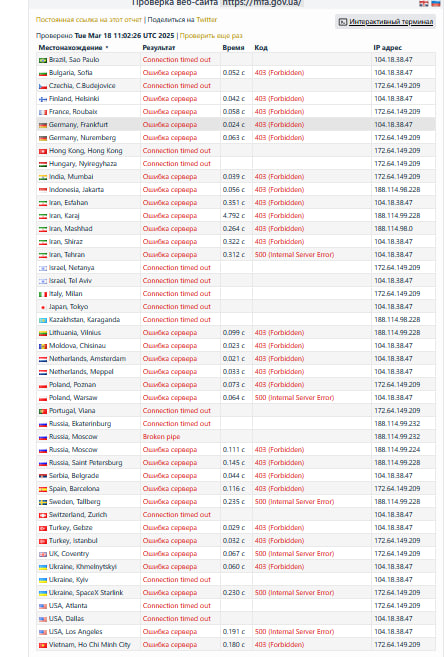
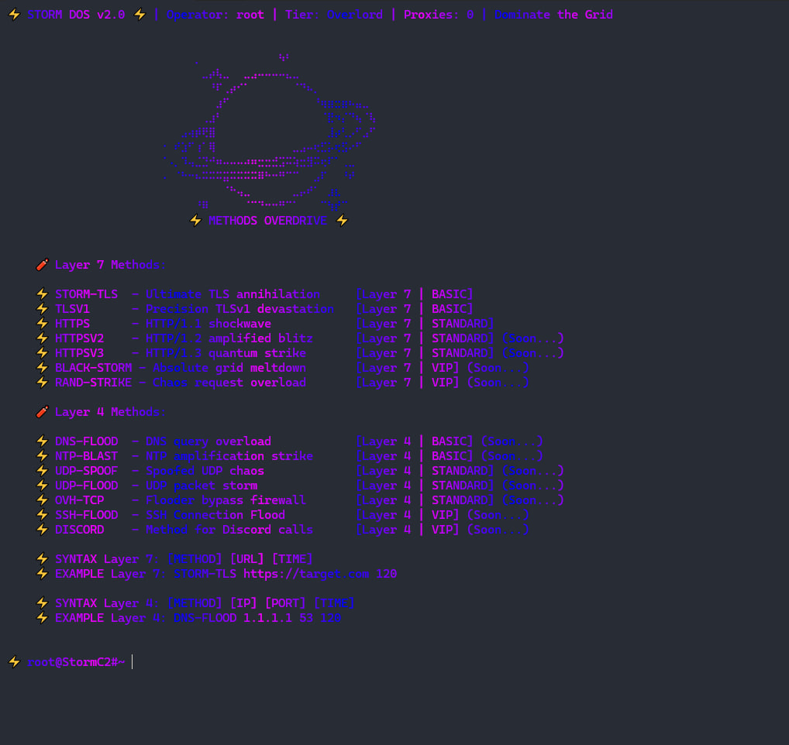
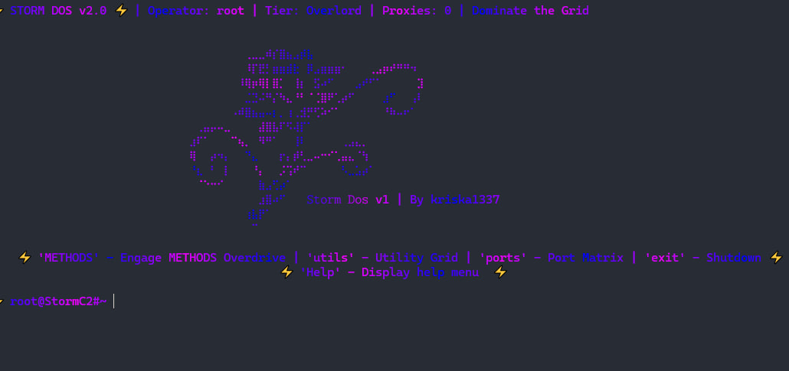

# 🌩️ Storm DoS

☠️ **Made by MoonRise Network**

---

## ⚡️ Setup Instructions

1. Install the required modules:
   ```bash
   pip install -r requirements.txt
   ```

2. Update the server configurations in `servers.json` with your own servers.

3. Upload the attack methods to your servers from the `tools` folder.

---

## 🚀 Running the Program

To start the Storm DoS panel, run the following command:
```bash
python panel.py
```

---

## 📷 Screenshots

- 
- 
- 
